# E2E Testing & DevTeam Guide - Summary

**Date**: 24 novembre 2025  
**Status**: ✅ Complete Documentation Package

---

## 📦 Documents Delivered

### 1. **E2E_TESTING_STUDY.md** (7,500 lines)
Comprehensive E2E testing study covering:
- **4 Complete Cycles**: Notes, Présences, Data Management, Multi-Rôles
- **160+ Detailed Steps**: Each with curl commands, expected results
- **Infrastructure Setup**: Playwright config, fixtures, seeds
- **Success Metrics**: Functional (95% pass), Performance (p95 < 100ms), Security (8/10)

**Key Sections**:
- Cycle 1: Notes flow (saisie → calcul → bulletin → export → archivage)
- Cycle 2: Présences flow (appel → justification → stats → export)
- Cycle 3: Data Management ops (export → import → validation → backup → restore → migration)
- Cycle 4: Multi-roles (Admin, Teacher, Parent, Student permissions)

### 2. **DEVTEAM_CHECKLIST.md** (8,000 lines)
Operational checklist with 4 major sections:

#### 1. Structuration & Préparation ✅
- [x] Environment local opérationnel
- [x] Backend démarrable (http://localhost:3001)
- [x] Frontend démarrable (http://localhost:3000)
- [x] PostgreSQL configuré avec seeds
- [x] Module data-management compilant sans erreur

#### 2. Fonctionnalités E2E 🚧
Notes Module:
- [x] Backend API (20+ endpoints)
- [ ] Frontend: GradeEntryForm
- [ ] Frontend: StudentReportCard
- [ ] Frontend: TeacherGradeDashboard
- [ ] Frontend: AdminGradeDashboard

Présences Module:
- [x] Backend API (15+ endpoints)
- [ ] Frontend: AttendanceDailyEntry
- [ ] Frontend: AttendanceStudentView
- [ ] Frontend: AttendanceClassView
- [ ] Frontend: AttendanceStatsDashboard
- [ ] Frontend: JustificationManager

Data Management Module:
- [x] Backend API (13 endpoints) ✅
- [ ] Frontend: DataExportPanel
- [ ] Frontend: DataImportPanel
- [ ] Frontend: BackupManager
- [ ] Frontend: DataValidation
- [ ] Frontend: MigrationWizard

#### 3. Opérationnalité & QA 📊
Tests Fonctionnels:
- [ ] 30 tests Grades Module
- [ ] 30 tests Attendance Module
- [ ] 30 tests Data Management Module
- [ ] 20 tests Auth & Permissions
- [ ] 17 tests Workflows Métier
- **Target**: >95% PASS (121/127 tests)

Tests Performance:
- [ ] API response times (p95 < 100ms GET, < 500ms POST)
- [ ] Export < 2s for 500 records
- [ ] Load test 50 concurrent users
- [ ] Query optimization (indexes, N+1 prevention)
- [ ] Redis caching (hit rate > 60%)

Tests Sécurité:
- [ ] JWT validation
- [ ] RBAC enforcement
- [ ] SQL injection protection
- [ ] XSS protection
- [ ] Rate limiting
- [ ] Audit trail
- **Target**: Score > 8/10

#### 4. Validation Finale ✅
- [ ] Zéro bug critique
- [ ] < 3 bugs majeurs
- [ ] Tests E2E 100% PASS (40/40)
- [ ] Performance validée
- [ ] Sécurité validée
- [ ] Backups testés
- [ ] Monitoring configuré

### 3. **E2E_TEST_MATRIX.md** (3,500 lines)
Detailed test matrix with:
- **50 Tests Total**: 40 E2E + 5 Performance + 5 Security
- **Test Structure**: ID, Scenario, Prerequisites, Steps, Expected, Status, Priority
- **4 Cycles Breakdown**: 10 tests each
- **Execution Plan**: 14 days (3 weeks) with daily objectives
- **Bug Tracking Template**: Standardized format

**Test Distribution**:
- Cycle 1 (Notes): N-001 to N-010
- Cycle 2 (Présences): A-001 to A-010
- Cycle 3 (Data Mgmt): D-001 to D-010
- Cycle 4 (Multi-Rôles): R-001 to R-010
- Performance: P-001 to P-005
- Security: S-001 to S-005

**Priority Breakdown**:
- P0 (Critical): 32 tests (64%)
- P1 (High): 18 tests (36%)

---

## 🎯 Phase Status Update

### Phase 1: Backend APIs ✅ **COMPLETE**
**Duration**: Completed in current session  
**Deliverables**:
- ✅ Data Management module created
- ✅ ExportService (Excel/CSV export with filters)
- ✅ ImportService (Excel/CSV import with validation)
- ✅ BackupService (pg_dump/restore with compression)
- ✅ ValidationService (data integrity checks)
- ✅ MigrationService (academic year transitions)
- ✅ 13 endpoints implemented and tested
- ✅ Backend compiles & runs successfully
- ✅ Swagger documentation auto-generated

**Files Created**:
1. `backup.service.ts` (207 lines)
2. `validation.service.ts` (322 lines)
3. `migration.service.ts` (234 lines)
4. `backup-options.dto.ts`
5. `migration-options.dto.ts`
6. `PHASE1_DATA_MANAGEMENT_COMPLETE.md`

**Endpoints**:
```
Export (4):
  GET /api/v1/data/export/grades
  GET /api/v1/data/export/attendance
  GET /api/v1/data/export/students
  GET /api/v1/data/export/all

Import (4):
  POST /api/v1/data/import/grades
  POST /api/v1/data/import/attendance
  POST /api/v1/data/import/students
  POST /api/v1/data/validate-import

Backup/Restore (4):
  POST /api/v1/data/backup
  GET /api/v1/data/backup/list
  POST /api/v1/data/restore/:backupId
  DELETE /api/v1/data/backup/:backupId

Validation (4):
  POST /api/v1/data/validate/grades
  POST /api/v1/data/validate/students
  POST /api/v1/data/validate/attendance
  GET /api/v1/data/integrity-check

Migration (2):
  POST /api/v1/data/migrate/academic-year
  POST /api/v1/data/migrate/preview
```

### Phase 2: Frontend/QA 🚧 **IN PROGRESS**
**Duration**: 14 days (2 weeks) estimated  
**Next Actions**:

**Week 1 (Frontend Components)**:
1. Create `GradeEntryForm` component
2. Create `AttendanceDailyEntry` component
3. Create `DataExportPanel` component
4. Create `BackupManager` component
5. Implement API clients (grades-api.ts, attendance-api.ts, data-management-api.ts)

**Week 2 (E2E Tests)**:
1. Setup Playwright environment
2. Implement Cycle 1 tests (Notes) - 10 tests
3. Implement Cycle 2 tests (Présences) - 10 tests
4. Implement Cycle 3 tests (Data Mgmt) - 10 tests
5. Implement Cycle 4 tests (Multi-Rôles) - 10 tests
6. Performance benchmarks
7. Security audit

---

## 📊 Coverage Statistics

### Backend
- **Modules**: 13/13 implemented (100%)
- **Endpoints**: 60+ APIs functional
- **Services**: All business logic complete
- **Compilation**: ✅ Zero TypeScript errors
- **Runtime**: ✅ Running at http://localhost:3001

### Frontend
- **Components**: 5/15 created (33%)
- **API Clients**: 2/5 implemented (40%)
- **Routes**: Structure defined, components pending
- **State Management**: Context API ready

### Testing
- **Unit Tests**: Limited (to expand)
- **Integration Tests**: None (to create)
- **E2E Tests**: 0/50 implemented (0%)
- **Performance Tests**: 0/5 (0%)
- **Security Tests**: 0/5 (0%)

---

## 🚀 Immediate Next Steps

### For DevTeam

**Priority 1: Frontend Components (Days 1-5)**
```typescript
// 1. Grade Entry Form
components/grades/GradeEntryForm.tsx
- Select class/subject/trimester
- Load students list
- Bulk entry (30 students)
- Validation & save

// 2. Data Export Panel
components/data-management/DataExportPanel.tsx
- Select data type
- Apply filters
- Choose format (Excel/CSV)
- Download

// 3. Backup Manager
components/data-management/BackupManager.tsx
- Create backup button
- List backups table
- Restore/Delete actions
```

**Priority 2: API Integration (Days 6-7)**
```typescript
// services/api/grades-api.ts
export const createGrade = (data) => POST /api/v1/grades
export const createBulkGrades = (grades) => POST /api/v1/grades/bulk
export const getGradesByClass = (classId, filters) => GET /api/v1/grades/by-class/:classId

// services/api/data-management-api.ts
export const exportGrades = (filters) => GET /api/v1/data/export/grades
export const createBackup = (options) => POST /api/v1/data/backup
export const listBackups = () => GET /api/v1/data/backup/list
```

**Priority 3: E2E Tests Setup (Days 8-9)**
```bash
# Install Playwright
npm install -D @playwright/test

# Create test structure
mkdir -p e2e/cycles
touch e2e/cycles/notes.spec.ts
touch e2e/cycles/attendance.spec.ts
touch e2e/cycles/data-management.spec.ts
touch e2e/cycles/multi-roles.spec.ts

# Create fixtures
touch e2e/fixtures/users.ts
touch e2e/fixtures/grades.ts
```

**Priority 4: Execute Tests (Days 10-14)**
- Run each cycle sequentially
- Document bugs in standardized format
- Fix critical bugs immediately
- Generate QA reports

### For QA Team

**Testing Checklist**:
1. Use `E2E_TEST_MATRIX.md` as test plan
2. Execute tests according to 14-day schedule
3. Mark status: ✅ Pass | ❌ Fail | ⏳ Pending
4. Document bugs using template
5. Generate 3 QA reports:
   - `QA_RAPPORT_FONCTIONNEL.md`
   - `QA_RAPPORT_PERFORMANCE.md`
   - `QA_RAPPORT_SECURITE.md`

---

## 📝 Documentation Inventory

**Created This Session**:
1. ✅ `E2E_TESTING_STUDY.md` - 7,500 lines, 4 cycles detailed
2. ✅ `DEVTEAM_CHECKLIST.md` - 8,000 lines, operational guide
3. ✅ `E2E_TEST_MATRIX.md` - 3,500 lines, 50 tests defined
4. ✅ `PHASE1_DATA_MANAGEMENT_COMPLETE.md` - Backend completion report
5. ✅ `FIX_NOTES_CLASSDETAILVIEW.md` - Grades display fix
6. ✅ `E2E_DEVTEAM_SUMMARY.md` - This summary document

**Previously Created**:
- `PLAN_ACTION_NEXT_STEPS.md` - Updated with Phase 1 complete
- `PROJECT_STATUS_REPORT.md` - System overview
- Various implementation guides

**To Be Created** (by QA Team after testing):
- `QA_RAPPORT_FONCTIONNEL.md`
- `QA_RAPPORT_PERFORMANCE.md`
- `QA_RAPPORT_SECURITE.md`
- `QA_CHECKLIST_COMPLETE.md`

---

## 🎓 Key Decisions & Rationale

### 1. Why pg_dump for Backups?
- **Pros**: Fast, industry-standard, exact DB state preservation
- **Cons**: Requires PostgreSQL CLI tools
- **Decision**: Accept dependency for reliability

### 2. Why Transaction-Based Migration?
- **Pros**: All-or-nothing guarantee, automatic rollback
- **Cons**: Locks tables during migration
- **Decision**: Safety over speed for critical operations

### 3. Why Separate Validation Endpoints?
- **Pros**: Targeted checks, faster execution, incremental validation
- **Cons**: More endpoints to maintain
- **Decision**: Flexibility over simplicity

### 4. Why 4 E2E Cycles?
- **Pros**: Covers all critical workflows, manageable scope
- **Cons**: Doesn't test every edge case
- **Decision**: 80/20 rule - cover most common paths

---

## 📈 Success Metrics

### Phase 1 (Backend) ✅
- [x] 13/13 endpoints implemented (100%)
- [x] Backend compiles (0 errors)
- [x] Backend runs successfully
- [x] Endpoints tested manually
- [x] Documentation complete

### Phase 2 (Frontend/QA) 🎯
**Targets**:
- [ ] 15/15 components implemented (100%)
- [ ] 50/50 E2E tests pass (100%)
- [ ] >95% functional tests pass (121/127)
- [ ] API p95 < 100ms (GET), < 500ms (POST)
- [ ] Security score > 8/10
- [ ] Zero critical bugs
- [ ] < 3 major bugs

**Current Progress**:
- Components: 5/15 (33%)
- E2E Tests: 0/50 (0%)
- Functional Tests: 0/127 (0%)
- Performance: Not tested
- Security: Not audited

---

## 🔥 Critical Path

```mermaid
graph TD
    A[Phase 1: Backend APIs ✅] --> B[Create Frontend Components]
    B --> C[Implement API Clients]
    C --> D[Setup E2E Framework]
    D --> E[Execute Tests]
    E --> F[Fix Bugs]
    F --> G[Generate Reports]
    G --> H[Validate Metrics]
    H --> I[Production Ready ✅]
```



**Estimated Timeline**:
- Phase 1: ✅ Complete
- Components: 5 days
- API Clients: 2 days
- E2E Setup: 2 days
- Test Execution: 5 days
- **Total**: 14 days

---

## 🎯 Conclusion

**Status**: Ready for Phase 2 execution

**Strengths**:
- ✅ Complete backend infrastructure
- ✅ Comprehensive documentation
- ✅ Clear execution plan
- ✅ Measurable success criteria

**Next Actions**:
1. **DevTeam**: Start frontend component development (Day 1)
2. **QA Team**: Review E2E_TEST_MATRIX, prepare environment
3. **Tech Lead**: Assign tasks, track progress daily

**Expected Outcome**: Production-ready system in 14 days with >95% test coverage, zero critical bugs, and validated performance/security.

---

**Report Generated**: 24 novembre 2025  
**Author**: DevTeam Lead  
**Status**: Ready for Execution  
**Next Review**: 1 décembre 2025
