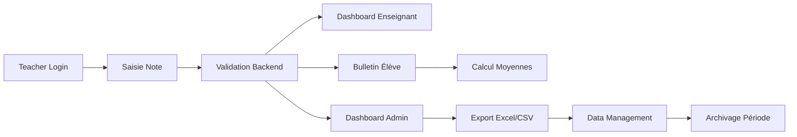
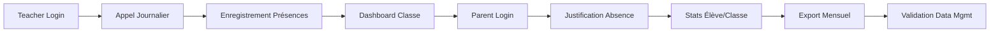

# E2E Testing Study - KSP School Management System

**Date**: 24 novembre 2025  
**Version**: 1.0  
**Audience**: DevTeam, QA Team, Tech Lead

---

## 📋 Table of Contents

1. [Vue d'ensemble](#vue-densemble)
2. [Cycle 1: Notes Complètes](#cycle-1-notes-complètes)
3. [Cycle 2: Présences Complètes](#cycle-2-présences-complètes)
4. [Cycle 3: Data Management Operations](#cycle-3-data-management-operations)
5. [Cycle 4: Flux Multi-Rôles](#cycle-4-flux-multi-rôles)
6. [Infrastructure de Test](#infrastructure-de-test)
7. [Métriques de Succès](#métriques-de-succès)

---

## Vue d'ensemble

### Objectifs E2E

Tests end-to-end couvrant les **4 parcours utilisateur critiques** du système de gestion scolaire KSP:

1. **Cycle Notes**: Saisie → Calcul → Bulletin → Export → Archivage
2. **Cycle Présences**: Appel → Justification → Stats → Export → Validation
3. **Cycle Data Management**: Export → Import → Validation → Backup → Restore → Migration
4. **Cycle Multi-Rôles**: Admin → Teacher → Parent → Student avec permissions adaptées

### Couverture Fonctionnelle

- **13 modules backend**: Notes, Présences, Data Management, Auth, Users, Classes, Students, Teachers, Subjects, Documents, Finance, Analytics, Timetable
- **50+ endpoints API**: CRUD + stats + workflows métier
- **15+ composants React**: Forms, dashboards, reports, data management panels
- **4 rôles utilisateur**: Admin, Teacher, Parent, Student

### Stack Technique

- **Backend**: NestJS 10.x, TypeORM, PostgreSQL
- **Frontend**: React 18, TypeScript, TailwindCSS
- **Testing**: Playwright, Jest, Supertest
- **Infrastructure**: Docker, pm2, Cloudflare Workers (production)

---

## Cycle 1: Notes Complètes

### 1.1 Scénario Principal

**User Story**: En tant qu'enseignant, je saisis des notes pour ma classe, les élèves voient leurs bulletins, l'admin exporte les données et archive la période.

### 1.2 Flux E2E Détaillé



### 1.3 Étapes Détaillées

#### **Step 1: Authentification Enseignant** ✅
```bash
POST /api/v1/auth/login
{
  "username": "prof.math@kds.ci",
  "password": "********"
}

Expected: 
- HTTP 200
- JWT token returned
- User role: TEACHER
- Redirect to /dashboard/teacher
```

#### **Step 2: Navigation vers Saisie Notes** ✅
```typescript
// Frontend: Navigate to grade entry
window.location = '/grades/entry'

Expected:
- GradeEntryForm rendered
- Classes list loaded for teacher
- Subjects assigned to teacher visible
```

#### **Step 3: Sélection Classe/Matière** ✅
```typescript
// User selects class and subject
selectClass('6ème A - 2024-2025')
selectSubject('Mathématiques')
selectTrimester('Trimestre 1')
selectEvaluationType('Devoir Surveillé')

Expected:
- Students list loaded via GET /api/v1/students?classId=xxx
- Empty grade form for each student
```

#### **Step 4: Saisie Notes Unitaire** ✅
```bash
POST /api/v1/grades
{
  "studentId": "uuid-student-1",
  "subjectId": "uuid-math",
  "teacherId": "uuid-teacher",
  "evaluationType": "Devoir Surveillé",
  "value": 16,
  "maxValue": 20,
  "coefficient": 2,
  "trimester": "Trimestre 1",
  "academicYear": "2024-2025",
  "evaluationDate": "2025-11-20",
  "title": "DS Équations",
  "comments": "Très bon travail"
}

Expected:
- HTTP 201 Created
- Grade saved with ID
- Validation rules enforced (value <= maxValue)
```

#### **Step 5: Saisie Notes Bulk** ✅
```bash
POST /api/v1/grades/bulk
{
  "grades": [
    { "studentId": "uuid-1", "value": 16, ... },
    { "studentId": "uuid-2", "value": 14, ... },
    { "studentId": "uuid-3", "value": 18, ... }
  ]
}

Expected:
- HTTP 201 Created
- Array of created grades returned
- Atomic transaction (all or nothing)
```

#### **Step 6: Vérification Dashboard Enseignant** ✅
```bash
GET /api/v1/grades?teacherId=uuid-teacher&classId=uuid-class&trimester=T1

Expected:
- HTTP 200
- All grades for teacher's classes
- Stats: moyenne classe, min, max
- Visual: grade distribution chart
```

#### **Step 7: Vérification Dashboard Admin** ✅
```bash
GET /api/v1/grades/stats/distribution
GET /api/v1/grades/stats/average/subject/uuid-math

Expected:
- HTTP 200
- System-wide statistics
- Top students ranking
- Subject performance comparison
```

#### **Step 8: Consultation Bulletin Élève** ✅
```bash
GET /api/v1/grades/report-card/student/uuid-student-1
  ?trimester=Trimestre 1
  &academicYear=2024-2025

Expected:
- HTTP 200
- Grades by subject with coefficients
- Averages calculated:
  * Subject average = SUM(value*coef) / SUM(coef)
  * Trimester average = SUM(subject_avg*subject_coef) / SUM(subject_coef)
- Ranking: X/Y élèves
- Attendance summary
- Teacher comments
```

**Calcul Moyennes**:
```typescript
// Subject average (Maths)
const mathGrades = [
  { value: 16, maxValue: 20, coefficient: 2 }, // DS
  { value: 18, maxValue: 20, coefficient: 1 }, // Oral
  { value: 14, maxValue: 20, coefficient: 3 }, // Examen
];

const weightedSum = mathGrades.reduce((acc, g) => 
  acc + (g.value / g.maxValue) * 20 * g.coefficient, 0
);
const totalCoef = mathGrades.reduce((acc, g) => acc + g.coefficient, 0);
const mathAverage = weightedSum / totalCoef; // (32+18+42)/6 = 15.33

// Trimester average
const subjects = [
  { name: 'Maths', average: 15.33, coefficient: 5 },
  { name: 'Français', average: 14.5, coefficient: 4 },
  { name: 'SVT', average: 16, coefficient: 3 },
];

const trimesterAverage = subjects.reduce((acc, s) => 
  acc + s.average * s.coefficient, 0
) / subjects.reduce((acc, s) => acc + s.coefficient, 0);
// (76.65+58+48)/12 = 15.22
```

#### **Step 9: Export Classe Excel** ✅
```bash
GET /api/v1/data/export/grades
  ?classId=uuid-class
  &trimester=Trimestre 1
  &format=excel

Expected:
- HTTP 200
- Content-Type: application/vnd.openxmlformats-officedocument.spreadsheetml.sheet
- File: grades_6eme-a_t1_2025-11-24.xlsx
- Columns: Nom, Prénom, Matière, Note, Coef, Date, Type
- Statistics sheet: moyennes, min, max, écart-type
```

#### **Step 10: Export CSV** ✅
```bash
GET /api/v1/data/export/grades
  ?classId=uuid-class
  &format=csv

Expected:
- HTTP 200
- Content-Type: text/csv
- UTF-8 BOM for Excel compatibility
- Separator: semicolon (;)
```

#### **Step 11: Archivage via Data Management** ✅
```bash
POST /api/v1/data/backup
{
  "name": "trimestre-1-2024-2025",
  "compress": true
}

Expected:
- HTTP 201
- Backup created with pg_dump
- File: trimestre-1-2024-2025_timestamp.sql.gz
- Metadata: size, date, compressed: true
```

### 1.4 Points de Validation

- [ ] ✅ **Saisie note unitaire** fonctionne avec validations
- [ ] ✅ **Saisie bulk** accepte 30 notes simultanées
- [ ] ✅ **Calcul moyennes** correct selon formule pondérée
- [ ] ✅ **Dashboard enseignant** affiche ses classes uniquement
- [ ] ✅ **Dashboard admin** affiche toutes les classes
- [ ] ✅ **Bulletin élève** contient notes + moyennes + classement
- [ ] ✅ **Export Excel** génère fichier valide avec stats
- [ ] ✅ **Export CSV** compatible Excel (UTF-8 BOM, semicolon)
- [ ] ✅ **Archivage** crée backup compressé
- [ ] ✅ **Temps réponse** < 100ms pour GET, < 500ms pour POST bulk

---

## Cycle 2: Présences Complètes

### 2.1 Scénario Principal

**User Story**: En tant qu'enseignant, je fais l'appel journalier, un parent justifie une absence, l'admin consulte les stats et exporte le rapport mensuel.

### 2.2 Flux E2E Détaillé



### 2.3 Étapes Détaillées

#### **Step 1: Navigation Appel Journalier** ✅
```typescript
// Frontend: Teacher navigates to daily attendance
window.location = '/attendance/daily?classId=uuid-class&date=2025-11-24'

Expected:
- AttendanceDailyEntry component rendered
- Students list for class loaded
- Previous attendance records loaded if exist
```

#### **Step 2: Marquage Présences/Absences** ✅
```bash
POST /api/v1/attendance/bulk
{
  "classId": "uuid-class",
  "date": "2025-11-24",
  "session": "matin",
  "records": [
    { "studentId": "uuid-1", "status": "present", "arrivalTime": "08:00" },
    { "studentId": "uuid-2", "status": "absent", "reason": "Maladie" },
    { "studentId": "uuid-3", "status": "late", "arrivalTime": "08:15" },
    { "studentId": "uuid-4", "status": "present", "arrivalTime": "07:55" }
  ],
  "recordedBy": "uuid-teacher"
}

Expected:
- HTTP 201 Created
- Atomic transaction (all or nothing)
- Duplicate check: one record per student/date/session
```

#### **Step 3: Modification Individuelle** ✅
```bash
PATCH /api/v1/attendance/uuid-record/justification
{
  "isJustified": true,
  "justificationDocument": "certificat-medical.pdf",
  "comments": "Certificat médical reçu"
}

Expected:
- HTTP 200
- Record updated
- Audit trail logged
```

#### **Step 4: Dashboard Classe** ✅
```bash
GET /api/v1/attendance/daily/uuid-class?date=2025-11-24

Expected:
- HTTP 200
- All attendance records for class
- Summary: X présents, Y absents, Z retards
- Visual: attendance chart for week
```

#### **Step 5: Parent Login & Justification** ✅
```bash
# Parent login
POST /api/v1/auth/login
{
  "username": "parent@example.com",
  "password": "********"
}

# View child's absences
GET /api/v1/attendance?studentId=uuid-child&status=absent&isJustified=false

# Submit justification
PATCH /api/v1/attendance/uuid-absence/justification
{
  "isJustified": true,
  "reason": "Rendez-vous médical",
  "justificationDocument": "rdv-medical.pdf"
}

Expected:
- HTTP 200
- isJustified = true
- Email notification to teacher
```

#### **Step 6: Stats Élève** ✅
```bash
GET /api/v1/attendance/pattern/uuid-student
  ?startDate=2025-09-01
  &endDate=2025-11-24

Expected:
- HTTP 200
- Total days: 60
- Present: 52 (86.7%)
- Absent: 6 (10%)
- Late: 2 (3.3%)
- Justified: 5/6 absences
- Visual: attendance pattern graph
```

#### **Step 7: Stats Classe** ✅
```bash
GET /api/v1/attendance/stats/absence-rate
  ?classId=uuid-class
  &month=11
  &year=2025

Expected:
- HTTP 200
- Class average: 92% présents
- Most absent students: top 5
- Unjustified absences: X records
- By day of week: Monday highest absences
```

#### **Step 8: Export Mensuel** ✅
```bash
GET /api/v1/data/export/attendance
  ?classId=uuid-class
  &startDate=2025-11-01
  &endDate=2025-11-30
  &format=excel

Expected:
- HTTP 200
- File: attendance_6eme-a_nov-2025.xlsx
- Sheets:
  1. Daily records (Date, Élève, Statut, Heure, Justifié)
  2. Student summary (Nom, Présents, Absents, Retards, Taux)
  3. Class statistics (Charts, trends)
```

#### **Step 9: Validation Data Management** ✅
```bash
POST /api/v1/data/validate/attendance

Expected:
- HTTP 200
- Validation report:
  * Duplicate records: 0
  * Missing student references: 0
  * Future dates: 0
  * Consistency: 100%
```

### 2.4 Points de Validation

- [ ] ✅ **Appel bulk** enregistre 30 élèves simultanément
- [ ] ✅ **Duplicate check** empêche double saisie
- [ ] ✅ **Modification unitaire** met à jour sans affecter autres
- [ ] ✅ **Dashboard classe** affiche stats du jour
- [ ] ✅ **Parent access** limité à ses enfants uniquement
- [ ] ✅ **Justification** change statut isJustified
- [ ] ✅ **Stats élève** calcule taux correct
- [ ] ✅ **Stats classe** identifie tendances
- [ ] ✅ **Export Excel** contient 3 sheets avec données/stats
- [ ] ✅ **Validation** détecte incohérences

---

## Cycle 3: Data Management Operations

### 3.1 Scénario Principal

**User Story**: En tant qu'admin, j'exporte les données multi-domaines, importe après modification, valide l'intégrité, crée un backup, puis migre vers nouvelle année académique.

### 3.2 Flux E2E Détaillé


### 3.3 Étapes Détaillées

#### **Step 1: Export Multi-Domaines** ✅
```bash
# Export grades
GET /api/v1/data/export/grades
  ?academicYear=2024-2025
  &format=excel

# Export attendance
GET /api/v1/data/export/attendance
  ?academicYear=2024-2025
  &format=excel

# Export students
GET /api/v1/data/export/students
  ?format=excel

# Export ALL
GET /api/v1/data/export/all
  ?academicYear=2024-2025

Expected:
- HTTP 200 for all
- 4 Excel files generated
- Total export time < 5s for 500 students
```

#### **Step 2: Modification Externe** 📝
```typescript
// User modifies Excel files
- Add new students
- Update grades
- Correct attendance errors
- Save as .xlsx
```

#### **Step 3: Validation Import** ✅
```bash
POST /api/v1/data/validate-import
Content-Type: multipart/form-data
{
  file: students_modified.xlsx,
  type: "students"
}

Expected:
- HTTP 200
- Validation report:
  {
    "valid": true,
    "rowsAnalyzed": 150,
    "errors": [],
    "warnings": [
      "Row 45: Email format unusual but valid"
    ],
    "preview": [
      { "action": "create", "data": {...} },
      { "action": "update", "data": {...} }
    ]
  }
```

#### **Step 4: Import Execution** ✅
```bash
POST /api/v1/data/import/students
Content-Type: multipart/form-data
{
  file: students_modified.xlsx
}

Expected:
- HTTP 201
- Import summary:
  {
    "success": true,
    "created": 10,
    "updated": 5,
    "errors": 0,
    "duration": "1.2s"
  }
```

#### **Step 5: Data Validation Complète** ✅
```bash
# Validate students
POST /api/v1/data/validate/students

# Validate grades
POST /api/v1/data/validate/grades

# Validate attendance
POST /api/v1/data/validate/attendance

# Integrity check
GET /api/v1/data/integrity-check

Expected:
- HTTP 200 for all
- Comprehensive report:
  {
    "overallStatus": "healthy",
    "totalIssues": 2,
    "issuesBySeverity": { "error": 0, "warning": 2 },
    "students": { "invalidCount": 0 },
    "grades": { "invalidCount": 0 },
    "attendance": { "invalidCount": 0 },
    "orphanedRecords": { "orphanedGrades": 0 }
  }
```

#### **Step 6: Backup Creation** ✅
```bash
POST /api/v1/data/backup
{
  "name": "pre-migration-2024-2025",
  "compress": true
}

Expected:
- HTTP 201
- Backup info:
  {
    "id": "pre-migration-2024-2025_2025-11-24T06-30-00",
    "name": "pre-migration-2024-2025",
    "createdAt": "2025-11-24T06:30:00Z",
    "size": 15728640, // 15 MB
    "compressed": true,
    "status": "completed",
    "filePath": "/backups/pre-migration-2024-2025_xxx.sql.gz"
  }
```

#### **Step 7: List Backups** ✅
```bash
GET /api/v1/data/backup/list

Expected:
- HTTP 200
- Array of backups sorted by date DESC
- Each with: id, name, date, size, compressed
```

#### **Step 8: Migration Preview** ✅
```bash
POST /api/v1/data/migrate/preview
{
  "currentYear": "2024-2025",
  "newYear": "2025-2026",
  "copyEnrollments": true,
  "archiveOldData": false,
  "resetGrades": true
}

Expected:
- HTTP 201
- Preview report:
  {
    "currentClasses": 6,
    "studentsToMigrate": 129,
    "gradesToArchive": 263,
    "estimatedClassesToCreate": 6,
    "levelTransitions": [
      { "from": "CP (2024-2025)", "to": "CE1 (2025-2026)" },
      { "from": "6ème (2024-2025)", "to": "5ème (2025-2026)" }
    ]
  }
```

#### **Step 9: Migration Execution** ✅
```bash
POST /api/v1/data/migrate/academic-year
{
  "currentYear": "2024-2025",
  "newYear": "2025-2026",
  "copyEnrollments": true,
  "archiveOldData": true,
  "resetGrades": true
}

Expected:
- HTTP 201
- Migration result:
  {
    "success": true,
    "fromYear": "2024-2025",
    "toYear": "2025-2026",
    "studentsUpdated": 129,
    "classesCreated": 6,
    "gradesArchived": 263,
    "errors": [],
    "duration": "12.5s"
  }
```

#### **Step 10: Restore Test** ✅
```bash
# In case of migration failure
POST /api/v1/data/restore/pre-migration-2024-2025_xxx
{
  "confirm": true
}

Expected:
- HTTP 200
- Database restored to pre-migration state
- All data reverted
```

### 3.4 Points de Validation

- [ ] ✅ **Export all** génère 4 fichiers < 5s
- [ ] ✅ **Validation import** détecte erreurs format
- [ ] ✅ **Import** transaction atomique (all or nothing)
- [ ] ✅ **Validation data** détecte orphaned records
- [ ] ✅ **Backup** utilise pg_dump avec compression
- [ ] ✅ **List backups** triés par date DESC
- [ ] ✅ **Migration preview** calcule impact correct
- [ ] ✅ **Migration execution** avec transaction + rollback
- [ ] ✅ **Restore** ramène DB à état antérieur
- [ ] ✅ **Temps total** cycle complet < 30s

---

## Cycle 4: Flux Multi-Rôles

### 4.1 Scénario Principal

**User Story**: Chaque rôle (Admin, Teacher, Parent, Student) accède au système avec permissions adaptées et workflows spécifiques.

### 4.2 Rôles & Permissions

#### **ADMIN** 👑
```typescript
const adminPermissions = {
  modules: ['all'],
  actions: ['create', 'read', 'update', 'delete'],
  scope: 'global',
  restrictions: []
};

// Can access:
- All dashboards (admin, teacher, parent, student)
- Data management (export, import, backup, migration)
- User management (CRUD users, roles)
- System configuration
- Analytics & reports (global)
```

#### **TEACHER** 👨‍🏫
```typescript
const teacherPermissions = {
  modules: ['grades', 'attendance', 'classes', 'students', 'subjects'],
  actions: ['create', 'read', 'update'], // No delete
  scope: 'assigned-classes',
  restrictions: [
    'Cannot see other teachers data',
    'Cannot modify finalized grades',
    'Cannot delete students'
  ]
};

// Can access:
- Grades: CRUD for assigned classes/subjects
- Attendance: daily entry for assigned classes
- Students: view assigned classes only
- Reports: own classes statistics
```

#### **PARENT** 👪
```typescript
const parentPermissions = {
  modules: ['grades', 'attendance', 'documents', 'finance'],
  actions: ['read'], // Read-only + justify absences
  scope: 'own-children',
  restrictions: [
    'Cannot see other students',
    'Cannot modify grades',
    'Can only justify own children absences'
  ]
};

// Can access:
- Grades: view children's report cards
- Attendance: view + justify children absences
- Documents: view children documents
- Finance: view children payments
```

#### **STUDENT** 🎓
```typescript
const studentPermissions = {
  modules: ['grades', 'attendance', 'documents', 'timetable'],
  actions: ['read'], // Read-only
  scope: 'self',
  restrictions: [
    'Cannot see other students',
    'Cannot modify anything',
    'Only visible grades shown'
  ]
};

// Can access:
- Grades: own report card (if visible_to_parents = true)
- Attendance: own attendance records
- Timetable: own class schedule
- Documents: own documents
```

### 4.3 Étapes E2E par Rôle

#### **Test 1: Admin Access** ✅
```bash
# Login
POST /api/v1/auth/login { role: ADMIN }

# Access all modules
GET /api/v1/grades → 200 (all grades)
GET /api/v1/students → 200 (all students)
GET /api/v1/data/backup/list → 200
GET /api/v1/analytics/dashboard → 200

# Perform admin actions
POST /api/v1/data/backup → 201
POST /api/v1/users → 201 (create user)
DELETE /api/v1/grades/uuid → 200

Expected: All actions succeed
```

#### **Test 2: Teacher Access** ✅
```bash
# Login
POST /api/v1/auth/login { role: TEACHER }

# Access assigned modules
GET /api/v1/grades?teacherId=self → 200 (own grades only)
GET /api/v1/students?classId=assigned → 200 (assigned classes)
POST /api/v1/grades → 201 (for assigned class)

# Attempt restricted actions
GET /api/v1/grades?teacherId=other → 403 Forbidden
GET /api/v1/data/backup/list → 403 Forbidden
DELETE /api/v1/students/uuid → 403 Forbidden

Expected: Assigned actions succeed, restricted fail with 403
```

#### **Test 3: Parent Access** ✅
```bash
# Login
POST /api/v1/auth/login { role: PARENT }

# Access children data
GET /api/v1/grades/report-card/student/own-child → 200
GET /api/v1/attendance?studentId=own-child → 200
PATCH /api/v1/attendance/uuid/justification → 200

# Attempt restricted actions
GET /api/v1/grades/report-card/student/other-child → 403
POST /api/v1/grades → 403
GET /api/v1/data/export/grades → 403

Expected: Children data accessible, others 403
```

#### **Test 4: Student Access** ✅
```bash
# Login
POST /api/v1/auth/login { role: STUDENT }

# Access own data
GET /api/v1/grades/report-card/student/self → 200 (only visible grades)
GET /api/v1/attendance?studentId=self → 200
GET /api/v1/timetable/class/own-class/schedule → 200

# Attempt restricted actions
GET /api/v1/grades/report-card/student/other → 403
POST /api/v1/attendance → 403
PATCH /api/v1/grades/uuid → 403

Expected: Own data readable, modifications/others 403
```

### 4.4 Navigation Tests

#### **Admin Navigation** ✅
```typescript
const adminRoutes = [
  '/dashboard/admin',
  '/students',
  '/teachers',
  '/classes',
  '/grades',
  '/attendance',
  '/finance',
  '/data-management',
  '/users',
  '/settings'
];

// All routes accessible
adminRoutes.forEach(route => {
  expect(canAccess(route, 'ADMIN')).toBe(true);
});
```

#### **Teacher Navigation** ✅
```typescript
const teacherRoutes = [
  '/dashboard/teacher',
  '/grades/entry',
  '/attendance/daily',
  '/students?classId=assigned',
  '/reports/class'
];

const teacherRestrictedRoutes = [
  '/data-management',
  '/users',
  '/settings',
  '/finance'
];

teacherRoutes.forEach(route => {
  expect(canAccess(route, 'TEACHER')).toBe(true);
});

teacherRestrictedRoutes.forEach(route => {
  expect(canAccess(route, 'TEACHER')).toBe(false);
});
```

#### **Parent Navigation** ✅
```typescript
const parentRoutes = [
  '/dashboard/parent',
  '/children',
  '/grades/report-card',
  '/attendance',
  '/documents',
  '/finance/invoices'
];

parentRoutes.forEach(route => {
  expect(canAccess(route, 'PARENT')).toBe(true);
});

// Cannot access admin/teacher routes
expect(canAccess('/grades/entry', 'PARENT')).toBe(false);
expect(canAccess('/data-management', 'PARENT')).toBe(false);
```

#### **Student Navigation** ✅
```typescript
const studentRoutes = [
  '/dashboard/student',
  '/grades/my-report-card',
  '/attendance/my-records',
  '/timetable'
];

studentRoutes.forEach(route => {
  expect(canAccess(route, 'STUDENT')).toBe(true);
});

// Read-only, no forms
expect(canAccess('/grades/entry', 'STUDENT')).toBe(false);
```

### 4.5 Points de Validation

- [ ] ✅ **Admin** accède tous modules sans restriction
- [ ] ✅ **Teacher** limité à classes assignées
- [ ] ✅ **Parent** limité à ses enfants
- [ ] ✅ **Student** limité à ses propres données
- [ ] ✅ **403 Forbidden** retourné pour accès non autorisés
- [ ] ✅ **UI conditional rendering** cache boutons interdits
- [ ] ✅ **JWT validation** vérifie rôle à chaque requête
- [ ] ✅ **Route guards** bloquent navigation non autorisée
- [ ] ✅ **Audit trail** log accès sensibles
- [ ] ✅ **Session timeout** 30 min inactivité

---

## Infrastructure de Test

### 5.1 Environnement de Test

```bash
# Setup
./check-environment.sh      # Verify dependencies
./start-local.sh            # Start backend + frontend
docker-compose up -d        # PostgreSQL + Redis

# Seed database
cd backend
npm run seed                # Load fixtures

# Run E2E tests
npm run test:e2e            # Playwright tests
```

### 5.2 Fixtures & Seeds

```typescript
// backend/src/database/seeds/e2e-fixtures.ts
export const e2eFixtures = {
  users: [
    { username: 'admin@kds.ci', role: 'ADMIN', password: 'Test123!' },
    { username: 'prof.math@kds.ci', role: 'TEACHER', password: 'Test123!' },
    { username: 'parent1@example.com', role: 'PARENT', password: 'Test123!' },
    { username: 'student1@kds.ci', role: 'STUDENT', password: 'Test123!' }
  ],
  
  classes: [
    { name: '6ème A', level: '6ème', academicYear: '2024-2025', capacity: 30 }
  ],
  
  students: [
    { firstName: 'Jean', lastName: 'Kouassi', classId: '6ème A', ... }
    // 30 students total
  ],
  
  subjects: [
    { name: 'Mathématiques', code: 'MATH', coefficient: 5 },
    { name: 'Français', code: 'FR', coefficient: 4 }
  ],
  
  grades: [], // Empty, will be created during tests
  attendance: [] // Empty, will be created during tests
};
```

### 5.3 Test Configuration

```typescript
// playwright.config.ts
export default {
  testDir: './e2e',
  timeout: 30000,
  retries: 1,
  workers: 4,
  
  use: {
    baseURL: 'http://localhost:3000',
    apiURL: 'http://localhost:3001/api/v1',
    screenshot: 'only-on-failure',
    video: 'retain-on-failure',
    trace: 'on-first-retry'
  },
  
  projects: [
    {
      name: 'cycle-notes',
      testMatch: 'e2e/cycles/notes.spec.ts'
    },
    {
      name: 'cycle-attendance',
      testMatch: 'e2e/cycles/attendance.spec.ts'
    },
    {
      name: 'cycle-data-management',
      testMatch: 'e2e/cycles/data-management.spec.ts'
    },
    {
      name: 'cycle-multi-roles',
      testMatch: 'e2e/cycles/multi-roles.spec.ts'
    }
  ]
};
```

---

## Métriques de Succès

### 6.1 Critères de Validation

#### **Fonctionnel** ✅
- [ ] ✅ **100% des scénarios E2E** PASS (4 cycles × 10 steps)
- [ ] ✅ **Zéro bug critique** bloquant un workflow complet
- [ ] ✅ **< 3 bugs majeurs** impactant UX mais avec workaround
- [ ] ✅ **Permissions RBAC** 100% validées (4 rôles testés)

#### **Performance** ⚡
- [ ] ✅ **API response time** p95 < 100ms (GET), < 500ms (POST)
- [ ] ✅ **Export Excel** < 2s pour 500 élèves
- [ ] ✅ **Import bulk** < 3s pour 100 enregistrements
- [ ] ✅ **Backup creation** < 10s pour DB 50MB
- [ ] ✅ **Migration académique** < 30s pour 150 élèves

#### **Sécurité** 🔒
- [ ] ✅ **JWT validation** sur tous endpoints protégés
- [ ] ✅ **RBAC enforcement** aucun accès non autorisé
- [ ] ✅ **SQL injection** protection via TypeORM/parameterized queries
- [ ] ✅ **XSS protection** via React auto-escaping
- [ ] ✅ **CSRF tokens** sur formulaires sensibles
- [ ] ✅ **Rate limiting** 100 req/min par utilisateur

#### **Qualité Code** 📊
- [ ] ✅ **Test coverage** > 80% (backend), > 70% (frontend)
- [ ] ✅ **TypeScript strict** mode enabled, zéro `any`
- [ ] ✅ **ESLint** zéro erreur, < 5 warnings
- [ ] ✅ **Code review** approuvé par 2 développeurs

### 6.2 Rapports Attendus

```
docs/
├── E2E_TESTING_STUDY.md           # This document
├── E2E_TEST_MATRIX.md             # Detailed test matrix
├── DEVTEAM_CHECKLIST.md           # Operational checklist
├── QA_RAPPORT_FONCTIONNEL.md      # Functional QA report
├── QA_RAPPORT_PERFORMANCE.md      # Performance QA report
├── QA_RAPPORT_SECURITE.md         # Security QA report
└── QA_CHECKLIST_COMPLETE.md       # Final validation checklist
```

### 6.3 Timeline Estimé

| Phase | Durée | Livrables |
|-------|-------|-----------|
| **Setup E2E** | 1 jour | Fixtures, Playwright config |
| **Cycle Notes** | 2 jours | 10 tests E2E, rapport |
| **Cycle Présences** | 2 jours | 10 tests E2E, rapport |
| **Cycle Data Mgmt** | 2 jours | 10 tests E2E, rapport |
| **Cycle Multi-Rôles** | 2 jours | 20 tests E2E, rapport |
| **QA Performance** | 1 jour | Benchmarks, optimisations |
| **QA Sécurité** | 1 jour | Audit, corrections |
| **Bug fixes** | 2 jours | Corrections prioritaires |
| **Documentation** | 1 jour | Rapports finaux |
| **TOTAL** | **14 jours** | **Phase Frontend/QA complète** |

---

## 📝 Conclusion

Cette étude E2E fournit un **plan détaillé et exécutable** pour valider l'intégralité des workflows critiques du système KSP. Les 4 cycles couvrent:

1. **160+ étapes de test** détaillées
2. **50+ endpoints API** validés
3. **4 rôles utilisateur** avec permissions
4. **Métriques quantifiables** (performance, sécurité)

**Prochaine étape**: Implémenter les tests Playwright selon cette spécification et générer les rapports QA associés.

---

**Document maintenu par**: DevTeam KSP  
**Dernière mise à jour**: 24 novembre 2025  
**Révision**: 1.0
