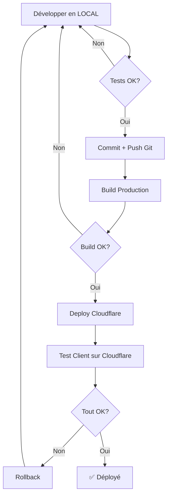

# 🌍 Guide de Séparation des Environnements

## Vue d'ensemble

Ce document explique la **séparation stricte** entre l'environnement **local de développement** et l'environnement **Cloudflare de test/production**.

---

## 📊 Architecture des Environnements

### 🔧 Environnement LOCAL (Développement)

**Frontend:**
- **Serveur**: Vite Dev Server
- **URL**: http://localhost:5173
- **Port**: 5173 (fixe)
- **Fichier de config**: `.env.local` (prioritaire) ou `.env.development`

**Backend:**
- **Framework**: NestJS
- **URL**: http://localhost:3001
- **Port**: 3001
- **Base de données**: PostgreSQL locale (port 5432)
- **Fichier de config**: `backend/.env.local` ou `backend/.env`

**Base de données:**
- **Type**: PostgreSQL
- **Host**: localhost
- **Port**: 5432
- **Database**: kds_school
- **Accès**: Direct via TypeORM

---

### 🚀 Environnement CLOUDFLARE (Test Client / Production)

**Frontend:**
- **Plateforme**: Cloudflare Pages
- **URL**: https://kds-school-management.pages.dev (ou domaine custom)
- **Build**: `npm run build` (mode production)
- **Déploiement**: `npm run deploy`

**Backend:**
- **Plateforme**: Cloudflare Workers
- **URL**: https://kds-backend-api.perissosdigitals.workers.dev
- **Runtime**: Workers Runtime (pas Node.js)
- **Fichier de config**: `backend/wrangler.toml`

**Base de données:**
- **Type**: Cloudflare D1 (SQLite-compatible)
- **Accès**: Via Workers Bindings
- **Storage**: Cloudflare R2 (documents)
- **Cache**: Cloudflare KV

---

## 🔑 Configuration des Variables d'Environnement

### Priorité des fichiers .env (Frontend)

```
1. .env.local          → JAMAIS commité, spécifique à votre machine
2. .env.development    → Pour dev par défaut si pas de .env.local
3. .env.production     → Pour build de production uniquement
```

### Fichier `.env.local` (DÉVELOPPEMENT LOCAL)

```bash
# 🔧 ENVIRONNEMENT LOCAL DE DÉVELOPPEMENT
VITE_API_URL=http://localhost:3001/api/v1
VITE_USE_MOCK_DATA=false
NODE_ENV=development
```

**✅ Ce qu'il fait:**
- Connecte le frontend Vite (5173) au backend NestJS local (3001)
- Utilise PostgreSQL locale
- **N'est JAMAIS commité** dans Git (dans `.gitignore`)

### Fichier `.env.development` (DÉVELOPPEMENT PAR DÉFAUT)

```bash
# 🧪 ENVIRONNEMENT DE DÉVELOPPEMENT
VITE_API_URL=http://localhost:3001/api/v1
VITE_USE_MOCK_DATA=false
```

**✅ Ce qu'il fait:**
- Configuration de développement partagée dans Git
- Utilisé si `.env.local` n'existe pas
- Backend local par défaut

### Fichier `.env.production` (CLOUDFLARE)

```bash
# 🚀 ENVIRONNEMENT DE PRODUCTION / TEST CLIENT
VITE_API_URL=https://kds-backend-api.perissosdigitals.workers.dev/api/v1
VITE_USE_MOCK_DATA=false
```

**✅ Ce qu'il fait:**
- Connecte au backend Cloudflare Workers
- Utilisé pendant `npm run build`
- Déployé sur Cloudflare Pages

---

## 🚦 Commandes par Environnement

### 🔧 Développement Local

```bash
# Frontend (Vite)
npm run dev                    # Démarre sur localhost:5173
npm run dev:status            # Vérifie si le frontend tourne

# Backend (NestJS)
cd backend
npm run start:dev             # Démarre sur localhost:3001

# Vérifications santé
curl http://localhost:5173    # Frontend
curl http://localhost:3001/api/v1/health  # Backend

# Base de données locale
psql -U kds_user -d kds_school  # Accès PostgreSQL
```

### 🚀 Déploiement Cloudflare

```bash
# Build de production (utilise .env.production)
npm run build                 # Génère dist/ avec URL Cloudflare

# Vérifier le build
npm run preview               # Prévisualise le build en local

# Déployer sur Cloudflare Pages
npm run deploy                # Push vers Cloudflare

# Backend Workers (depuis backend/)
cd backend
npx wrangler deploy           # Déploie le Worker
```

---

## 🔒 Sécurité et Bonnes Pratiques

### ✅ À FAIRE

1. **Toujours vérifier** quelle URL backend est configurée avant de tester
2. **Utiliser `.env.local`** pour votre config personnelle locale
3. **Tester localement** avant de déployer sur Cloudflare
4. **Séparer les données** : données de test en local, données réelles sur Cloudflare
5. **Documenter** les changements de schéma de base de données

### ❌ À ÉVITER

1. **NE JAMAIS** commiter `.env.local` dans Git
2. **NE PAS** mélanger les URLs (local ↔ Cloudflare) dans le même environnement
3. **NE PAS** tester en production sans passer par local d'abord
4. **NE PAS** partager les API keys dans les fichiers .env committés

---

## 🧪 Comment Tester la Séparation

### Vérifier la configuration actuelle

```bash
# Frontend - voir quelle URL est utilisée
cat .env.local | grep VITE_API_URL

# Ou vérifier dans le navigateur (console)
console.log(import.meta.env.VITE_API_URL)
```

### Test Local Complet

```bash
# 1. Vérifier qu'on est bien en local
cat .env.local | grep localhost     # Doit afficher localhost:3001

# 2. Démarrer backend local
cd backend && npm run start:dev

# 3. Démarrer frontend local
npm run dev

# 4. Tester dans le navigateur
# Ouvrir: http://localhost:5173
# DevTools → Network → Vérifier que les requêtes vont vers localhost:3001
```

### Test Build Production (avant déploiement)

```bash
# 1. Build avec config production
npm run build

# 2. Vérifier le fichier généré
cat dist/assets/index-*.js | grep "api.perissosdigitals"  # Doit trouver l'URL Cloudflare

# 3. Prévisualiser
npm run preview

# 4. Si OK, déployer
npm run deploy
```

---

## 🗄️ Bases de Données Parallèles

### PostgreSQL Local (Développement)

```
Host: localhost
Port: 5432
Database: kds_school
User: kds_user
```

**Données:**
- Données de test/développement
- Peut être réinitialisée librement
- Seed data pour tests

### Cloudflare D1 (Production/Test Client)

```
Binding: DB
Type: D1 Database
Access: Via Workers Runtime
```

**Données:**
- Données réelles de test client
- Persistantes
- Migrations contrôlées

---

## 📝 Workflow de Développement Recommandé



### Étapes détaillées:

1. **Développement Local**
   - Modifier le code
   - Tester sur `http://localhost:5173`
   - Backend local répond sur `localhost:3001`

2. **Tests Locaux**
   - CRUD operations
   - Workflows complets
   - Pas d'erreurs console

3. **Commit & Push**
   - Git commit des changements
   - Push vers `main` ou branche de feature

4. **Build Production**
   ```bash
   npm run build
   # Vérifie que .env.production est utilisé
   ```

5. **Déploiement Cloudflare**
   ```bash
   npm run deploy
   # Push vers Cloudflare Pages
   ```

6. **Test Client**
   - Tester sur l'URL Cloudflare
   - Vérifier API Cloudflare Workers
   - Validation complète

---

## 🆘 Dépannage

### Problème: Frontend local se connecte à Cloudflare

**Solution:**
```bash
# 1. Vérifier .env.local
cat .env.local | grep VITE_API_URL
# Doit afficher: VITE_API_URL=http://localhost:3001/api/v1

# 2. Si mauvaise URL, corriger:
echo "VITE_API_URL=http://localhost:3001/api/v1" > .env.local

# 3. Redémarrer Vite
pkill -f vite
npm run dev
```

### Problème: Build production pointe vers localhost

**Solution:**
```bash
# Vérifier .env.production
cat .env.production | grep VITE_API_URL
# Doit afficher: VITE_API_URL=https://kds-backend-api.perissosdigitals.workers.dev/api/v1

# Build avec mode explicite
npm run build -- --mode production
```

### Problème: Backend local ne démarre pas

**Solution:**
```bash
# Tuer processus existants
pkill -f "nest start"
lsof -ti:3001 | xargs kill -9

# Redémarrer
cd backend
npm run start:dev
```

---

## 📋 Checklist Avant Déploiement

- [ ] ✅ Tests locaux complets (localhost:5173 → localhost:3001)
- [ ] ✅ Pas d'erreurs console en local
- [ ] ✅ CRUD operations fonctionnent
- [ ] ✅ `.env.production` contient URL Cloudflare
- [ ] ✅ `npm run build` réussit sans erreurs
- [ ] ✅ `npm run preview` fonctionne
- [ ] ✅ Git commit + push effectués
- [ ] ✅ Backend Cloudflare Workers déployé si modifié
- [ ] ✅ Migrations DB Cloudflare appliquées si nécessaire
- [ ] ✅ Test final sur URL Cloudflare après déploiement

---

## 🎯 Résumé

| Aspect | Local (Dev) | Cloudflare (Prod/Test) |
|--------|-------------|------------------------|
| **Frontend URL** | http://localhost:5173 | https://kds-school-management.pages.dev |
| **Backend URL** | http://localhost:3001 | https://kds-backend-api.perissosdigitals.workers.dev |
| **Database** | PostgreSQL (localhost:5432) | Cloudflare D1 |
| **Storage** | Système de fichiers local | Cloudflare R2 |
| **Config File** | `.env.local` | `.env.production` |
| **Command** | `npm run dev` | `npm run build && npm run deploy` |
| **Données** | Test/développement | Réelles (test client) |

---

**Berakhot ve-Shalom! 🙏**

*Ce guide assure une séparation nette entre dev local et environnement Cloudflare.*
