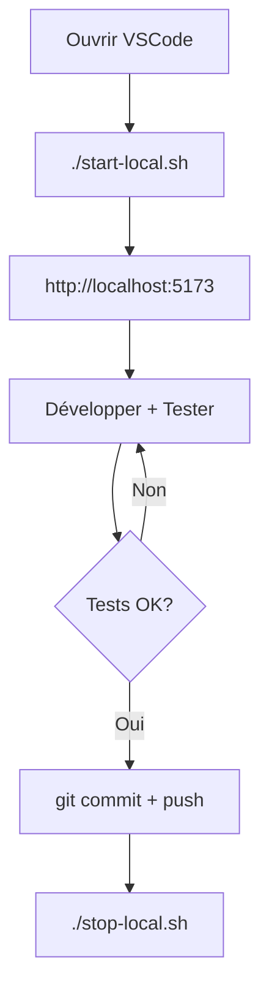
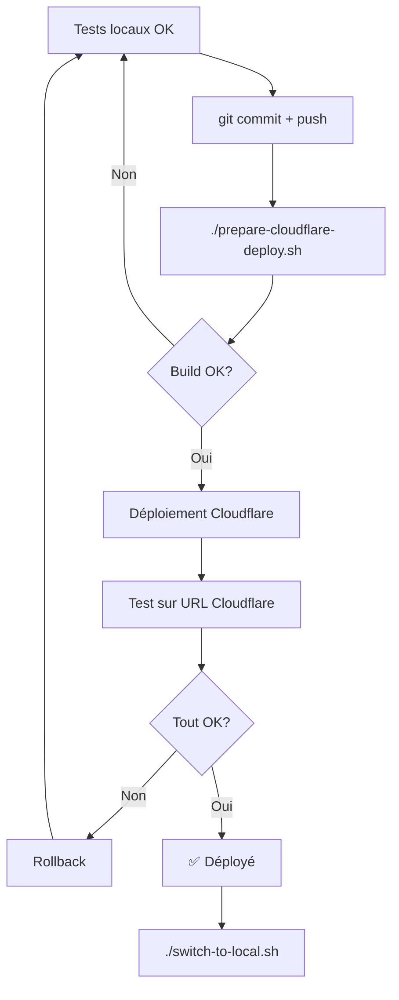

# ✅ Séparation des Environnements - Résumé

**Date**: 19 novembre 2025  
**Statut**: ✅ IMPLÉMENTÉ ET TESTÉ

---

## 🎯 Objectif Atteint

Séparation **complète et claire** entre:
- **Environnement LOCAL** (développement)
- **Environnement CLOUDFLARE** (test client / production)

---

## 📁 Fichiers Créés/Modifiés

### Configuration

| Fichier | Rôle | Committable |
|---------|------|-------------|
| `.env.local` | Config LOCAL (prioritaire) | ❌ Non (dans .gitignore) |
| `.env.development` | Config dev par défaut | ✅ Oui |
| `.env.production` | Config Cloudflare | ✅ Oui |

### Scripts de Gestion

| Script | Description |
|--------|-------------|
| `start-local.sh` | Démarre backend + frontend + watchdog |
| `stop-local.sh` | Arrête tous les services locaux |
| `check-environment.sh` | Vérifie la configuration actuelle |
| `switch-to-local.sh` | Force le mode développement local |
| `prepare-cloudflare-deploy.sh` | Prépare et déploie sur Cloudflare |

### Documentation

| Document | Contenu |
|----------|---------|
| `ENVIRONMENT_SEPARATION_GUIDE.md` | Guide complet 🔥 |
| `README.md` | Mis à jour avec instructions |
| Ce fichier | Résumé de l'implémentation |

---

## 🔧 Configuration Actuelle

### LOCAL (Développement)

```bash
Frontend:  http://localhost:5173 (Vite)
Backend:   http://localhost:3001 (NestJS)
Database:  PostgreSQL localhost:5432
Config:    .env.local (JAMAIS commité)
```

**Variables clés:**
```bash
VITE_API_URL=http://localhost:3001/api/v1
VITE_USE_MOCK_DATA=false
NODE_ENV=development
```

### CLOUDFLARE (Production/Test)

```bash
Frontend:  https://kds-school-management.pages.dev
Backend:   https://kds-backend-api.perissosdigitals.workers.dev
Database:  Cloudflare D1 + R2
Config:    .env.production (committable)
```

**Variables clés:**
```bash
VITE_API_URL=https://kds-backend-api.perissosdigitals.workers.dev/api/v1
VITE_USE_MOCK_DATA=false
NODE_ENV=production
```

---

## 🚀 Utilisation Quotidienne

### Démarrage du Jour

```bash
# 1. Vérifier l'environnement
./check-environment.sh

# 2. Si pas en mode local, basculer
./switch-to-local.sh

# 3. Démarrer l'environnement complet
./start-local.sh

# ✅ Travailler sur http://localhost:5173
```

### Fin de Journée

```bash
# Arrêter les services
./stop-local.sh
```

### Déploiement

```bash
# 1. Tests locaux complets
# ... tester sur http://localhost:5173 ...

# 2. Préparer et déployer
./prepare-cloudflare-deploy.sh

# 3. Revenir en mode local
./switch-to-local.sh
```

---

## ✅ Tests de Validation

### Test 1: Vérification Environnement LOCAL ✅

```bash
$ ./check-environment.sh

✅ Configuration: DÉVELOPPEMENT LOCAL
→ Frontend Vite (5173) → Backend NestJS (3001) → PostgreSQL (5432)
```

### Test 2: Services Actifs ✅

```bash
$ curl http://localhost:3001/api/v1/health
{
  "status": "ok",
  "timestamp": "2025-11-19T14:56:31.454Z",
  "service": "kds-api-gateway"
}

$ curl -I http://localhost:5173
HTTP/1.1 200 OK
```

### Test 3: Séparation Backend ✅

```bash
# LOCAL backend répond
$ curl http://localhost:3001/api/v1/health
✅ OK

# CLOUDFLARE backend répond aussi (indépendant)
$ curl https://kds-backend-api.perissosdigitals.workers.dev/api/v1/health
✅ OK
```

---

## 🛡️ Sécurité

### ✅ Implémenté

1. **`.env.local` dans `.gitignore`**
   - Garantit que la config locale n'est jamais commitée
   - Chaque développeur a sa propre config

2. **Séparation stricte des URLs**
   - Local: `localhost:3001`
   - Cloudflare: `*.workers.dev`
   - Pas de confusion possible

3. **Scripts de vérification**
   - `check-environment.sh` détecte les mauvaises configurations
   - Alertes si frontend local → backend Cloudflare

4. **Documentation complète**
   - `ENVIRONMENT_SEPARATION_GUIDE.md` explique tout
   - README mis à jour avec instructions claires

---

## 📊 Architecture Finale

```
┌─────────────────────────────────────────────────────────┐
│                   DÉVELOPPEMENT LOCAL                    │
├─────────────────────────────────────────────────────────┤
│                                                           │
│  Navigateur                                               │
│      ↓                                                    │
│  http://localhost:5173 (Vite Frontend)                   │
│      ↓                                                    │
│  http://localhost:3001/api/v1 (NestJS Backend)          │
│      ↓                                                    │
│  PostgreSQL localhost:5432                                │
│                                                           │
│  Config: .env.local (NON COMMITÉ)                        │
└─────────────────────────────────────────────────────────┘

┌─────────────────────────────────────────────────────────┐
│              PRODUCTION / TEST CLIENT                    │
├─────────────────────────────────────────────────────────┤
│                                                           │
│  Navigateur                                               │
│      ↓                                                    │
│  https://kds-school-management.pages.dev (CF Pages)      │
│      ↓                                                    │
│  https://*.workers.dev/api/v1 (CF Workers)               │
│      ↓                                                    │
│  Cloudflare D1 + R2                                       │
│                                                           │
│  Config: .env.production (COMMITÉ)                       │
└─────────────────────────────────────────────────────────┘
```

---

## 📝 Workflows

### Workflow Développement



### Workflow Déploiement



---

## 🎓 Leçons Apprises

### Problèmes Résolus

1. **Confusion des URLs**
   - ❌ Avant: Frontend local appelait parfois Cloudflare
   - ✅ Après: Séparation claire avec `.env.local` prioritaire

2. **Difficulté à tester**
   - ❌ Avant: Pas clair quel environnement était actif
   - ✅ Après: `check-environment.sh` montre tout

3. **Services instables**
   - ❌ Avant: Vite crashait sans redémarrage
   - ✅ Après: Watchdog auto-restart intégré

4. **Déploiement hasardeux**
   - ❌ Avant: Build avec mauvaise config
   - ✅ Après: `prepare-cloudflare-deploy.sh` vérifie tout

---

## 🔜 Prochaines Étapes

### Optionnel - Améliorations Futures

1. **Docker Compose**
   - Conteneuriser PostgreSQL
   - Un seul `docker-compose up` pour tout démarrer

2. **CI/CD Pipeline**
   - GitHub Actions pour tests automatiques
   - Déploiement auto sur Cloudflare après merge

3. **Environnement Staging**
   - Ajouter un 3ème environnement entre dev et prod
   - `.env.staging` pour tests pré-production

4. **Monitoring**
   - Alertes si backend Cloudflare down
   - Logs centralisés (Cloudflare Analytics)

---

## ✅ Checklist Finale

- [x] ✅ `.env.local` créé et configuré pour local
- [x] ✅ `.env.development` pour dev par défaut
- [x] ✅ `.env.production` pour Cloudflare
- [x] ✅ `.env.local` dans `.gitignore`
- [x] ✅ Scripts de gestion créés et testés
- [x] ✅ `start-local.sh` fonctionne
- [x] ✅ `stop-local.sh` fonctionne
- [x] ✅ `check-environment.sh` fonctionne
- [x] ✅ Watchdog frontend intégré
- [x] ✅ Backend + Frontend locaux actifs
- [x] ✅ Health checks passent
- [x] ✅ Documentation complète créée
- [x] ✅ README mis à jour
- [x] ✅ Tests de validation effectués

---

## 📞 Support

**Questions/Problèmes?**

1. Consulter `ENVIRONMENT_SEPARATION_GUIDE.md`
2. Exécuter `./check-environment.sh`
3. Vérifier les logs: `/tmp/kds-*.log`

---

**Berakhot ve-Shalom! 🙏**

*La séparation des environnements est maintenant claire, documentée et fonctionnelle.*
